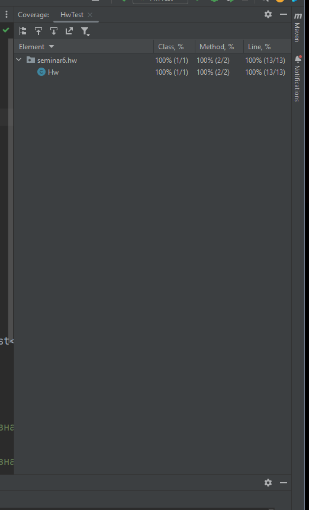

# Отчет о покрытии тестами 

В данной домашней работе покрыто тестами 4 сценариев работы методов. Так как метод
compareAverages внутри себя вызывает метод calculateAverage, то при его работе уже будет провериться интеграционная составляющая.

**1 сценарий:** Работа метода calculateAverage \
**2 сценарий:** Работа метода compareAverages, если среднее значение первого списка больше \
**3 сценарий:** Работа метода compareAverages, если среднее значение второго списка больше \
**4 сценарий:** Работа метода compareAverages, если средние значения списков равны

